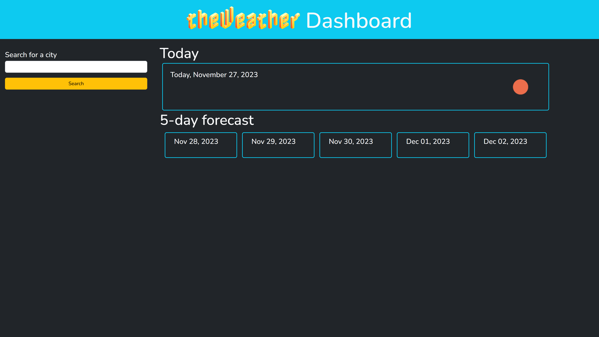
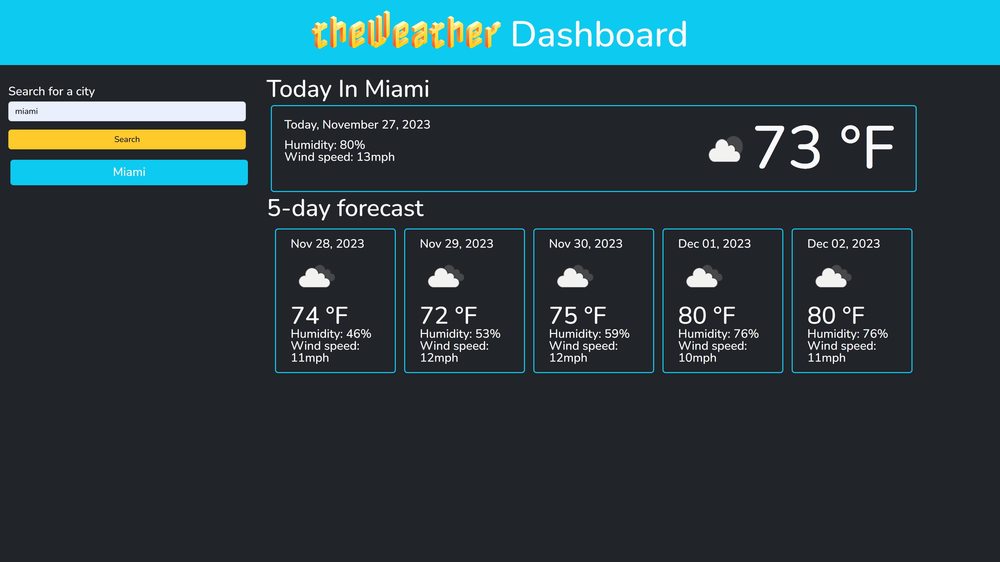
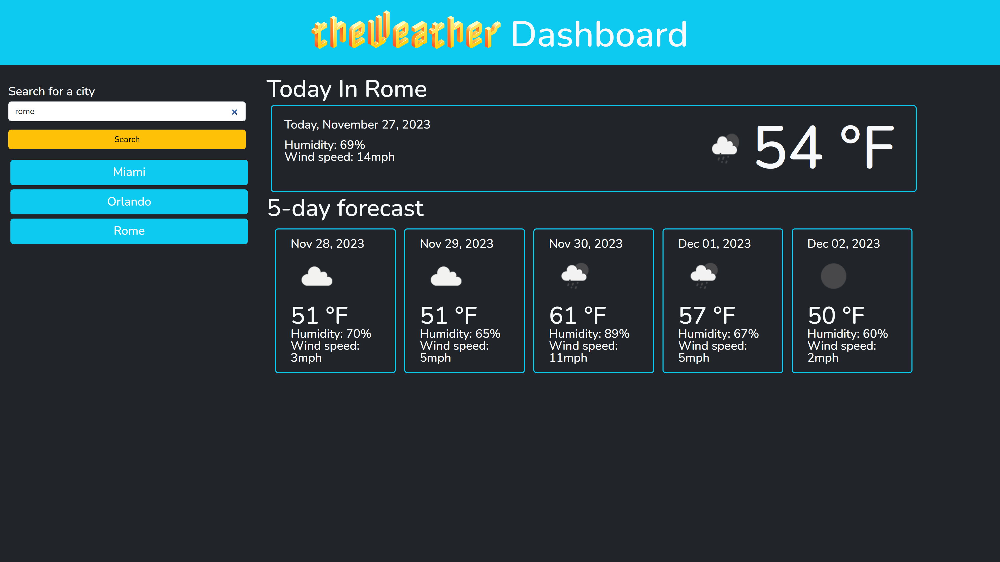
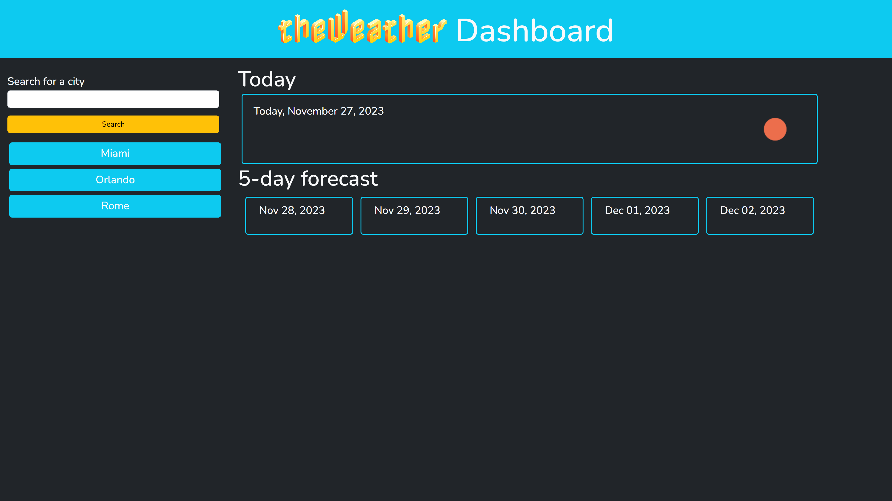

# theWeather Dashboard

## Description

Provide a short description explaining the what, why, and how of your project. Use the following questions as a guide:
I wanted to practice my server-side API knowledge so I built this weather forecast app to be able to retrive multiple data points about an specific city's weather and it's near future forecast, the app can get me all the info regarding tempeture, humidity, wind speed and overall sky conditions for today and 5 days ahead of any city based on name, I learned parsing can be hard but I like it

## Usage

Upon page loading you'll find today's date and a search far to help you find wherever you want, takes city names and zipcodes.

After you search your city, you'll be presented with today's and 5-days ahead forecast

If your search several cities the app will save your past searches and you can click on them to get their forecast

And your searches will persist so you'll find them on the app next time you come around

